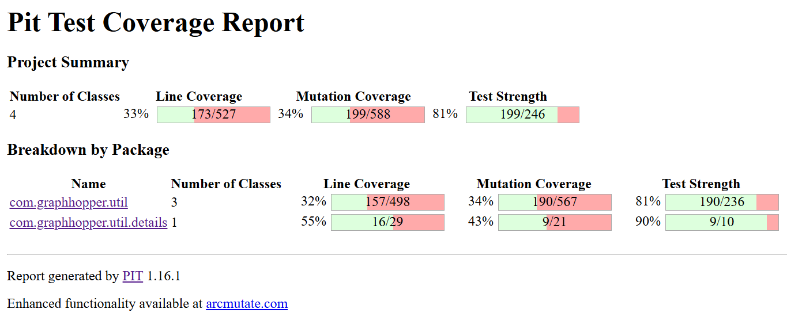
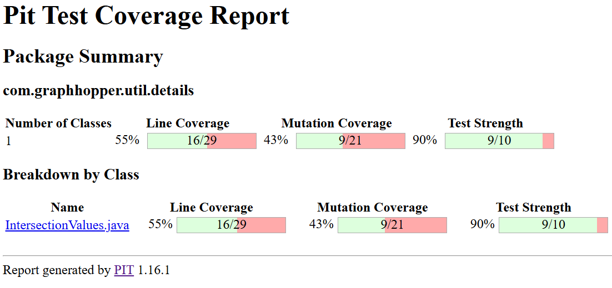

# Documentation for IFT3913 task, université de Montréal.

**authors** : Johanny Titouan, Mohamed Terbaoui.
**date** : Automn 2025.

## Classes containing the required tests

[NewGHUtilityTest](core/src/test/java/com/graphhopper/util/NewGHUtilityTest.java) contiens les tests de la classe
[GHUtility](core/src/main/java/com/graphhopper/util/GHUtility.java)

[NewArrayUtilTest](core/src/test/java/com/graphhopper/util/NewArrayUtilTest.java) contiens les tests de la classe
[ArrayUtil](core/src/main/java/com/graphhopper/util/ArrayUtil.java)

[NewDistanceCalcEuclideanTest](core/src/test/java/com/graphhopper/util/NewDistanceCalcEuclideanTest.java) contiens les tests de la classe
[DistanceCalcEuclidean](core/src/main/java/com/graphhopper/util/DistanceCalcEuclidean.java)

[NewIntersectionValuesTest](core/src/test/java/com/graphhopper/util/NewIntersectionValuesTest.java) contiens les tests de la classe
[IntersectionValues](core/src/main/java/com/graphhopper/util/details/IntersectionValues.java)

## Couverture de code avant/après nos tests

Avant:


Après:


## Tests de mutations avec PiTest

1. Effectuer une analyse de analyse de mutation

```bash
mvn -q -f core/pom.xml -Dpitest.targetClasses=com.graphhopper.util.GHUtility,com.graphhopper.util.DistanceCalcEuclidean,com.graphhopper.util.details.IntersectionValues,com.graphhopper.util.ArrayUtil org.pitest:pitest-maven:1.16.1:mutationCoverage
```

Les résultats se trouvent dans le dossier [target/pit-reports](core/target/pit-reports).

2. Calculer le score de mutation des tests originaux seulement :

   Dans core/pom.xml, commenter la ligne :

```xml
<param>com.graphhopper.util.NewDistanceCalcEuclideanTest</param>
<param>com.graphhopper.util.NewGHUtilityTest</param>
<param>com.graphhopper.util.NewArrayUtilTest</param>
<param>com.graphhopper.util.NewIntersectionValuesTest</param>
```

Puis lancer la même commande que dans le point 1.

##

Résultats :
Mutation coverage: 142/588 (~24%)


3. Calculer le score de mutation avec les nouveaux tests :

   Décommenter la ligne précédemment citée dans pom.xml, puis lancer la même commande.

Résultats :
Mutation coverage: 199/588 (~34%)





## Test avec Java-faker

Trois tests avec Java Faker sont disponibles dans le fichier [NewGHUtilityTest.java](core/src/test/java/com/graphhopper/util/NewGHUtilityTest.java).
Ils testent les fonctionnalités en générant des valeurs aléatoires à insérer dans les graphes.
